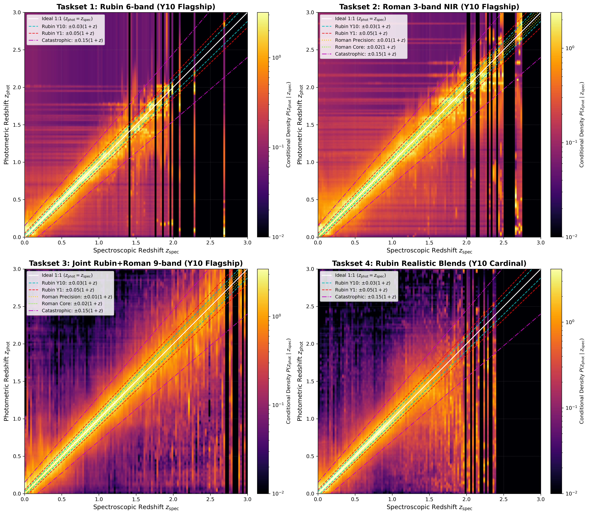
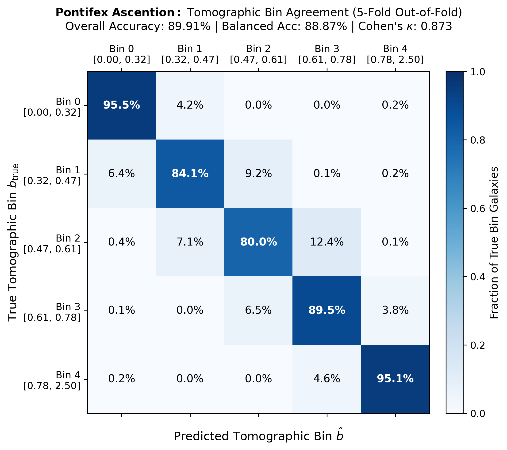

# Pontifex

[](https://pontifex.readthedocs.io/en/latest/?badge=latest)
[](https://github.com/mardom/Pontifex)
[](https://github.com/mardom/Pontifex/releases)

A unified, high-performance photometric redshift estimation and tomographic distribution reconstruction pipeline engineered for the Vera C. Rubin Observatory Legacy Survey of Space and Time (LSST) and the Nancy Grace Roman Space Telescope.

---

## Unified Architecture (v2.0.0)

Pontifex 2.0.0 is structured into three decoupled subpackages designed to tackle both individual photo-z PDF estimation and wide-area tomographic ensemble reconstruction:

```
src/pontifex/
├── core/             # Shared transformations, resilient guards, filter constants, metrics
│   ├── constants.py  # Bandpass definitions (Rubin ugrizy + Roman YJH), bin edges
│   ├── features.py   # Pogson flux conversion, feature extraction, color synthesis
│   ├── guard.py      # Resilient input validation & unphysical record imputation
│   └── metrics.py    # DESC SRD Stage IV moments bias (delta_mu, delta_sigma), photo-z stats
├── pz/               # Individual photo-z PDF estimation & Mixture of Experts
│   ├── em.py         # PontifexEM footprint gating via Nugundam + SkyKatana
│   ├── estimators.py # CommitteeOfExperts (kNN, MLP, BPZ-lite, FlexZBoost, GPz, LePhare)
│   └── pipeline.py   # End-to-end train_and_estimate and estimate_only workflows
└── nz/               # Tomographic ensemble n(z) reconstruction & spatial realizations
    ├── som.py        # MiniSom transfer density ratio weights w(c) = P_WFD(c) / P_DDF(c)
    ├── classifier.py # XGBoost tomographic bin classifier & MoE entropy regularization
    ├── calibration.py# Empirical transfer-weighted calibration histograms
    ├── sampler.py    # Correlated Gaussian Process spatial realization sampler (ell_z = 0.15)
    └── runner.py     # Automated challenge taskset runners (Tasksets 1, 2, 3)
```

---

## Installation & Setup

```bash
# Clone repository
git clone https://github.com/mardom/Pontifex.git
cd Pontifex

# Create and activate environment
conda create -n pontifex_env python=3.13 numpy scipy pandas astropy matplotlib -y
conda activate pontifex_env

# Install dependencies and Pontifex in editable mode
pip install -r requirements.txt
pip install -e .

# Run test suite
pytest tests/
```

---

## Quickstart Guide

### 1. Individual Photo-z Estimation (`pontifex.pz`)

```python
from pontifex.pz import train_and_estimate, estimate_only

# Train committee and predict on test catalog with EM spatial calibration
train_and_estimate(
    train_file="data/training_catalog.hdf5",
    test_file="data/test_catalog.hdf5",
    output_file="output_estimate_pz.hdf5",
    save_model_to="models/pontifex_pz.joblib",
)
```

### 2. Tomographic $n(z)$ Reconstruction (`pontifex.nz`)

```python
from pontifex.nz import (
    run_taskset_training_and_estimation,
    run_taskset_estimation_only,
)

# Train XGBoost with SOM density transfer reweighting and predict tomographic bins
run_taskset_training_and_estimation(
    key="taskset_2_cardinal_1yr",
    wfd_file="public/nz_challenge_taskset_2_cardinal_1yr_wfd.hdf5",
    models_dir="models/pontifex",
    ddf_files=[f"public/nz_challenge_taskset_2_cardinal_1yr_ddf_{i:02d}.hdf5" for i in range(5)],
    output_nz_estimate_file="submission/nz_estimate.hdf5",
    output_bhat_file="submission/bhat.hdf5",
    output_nz_samples_file="submission/nz_samples.hdf5",
)
```

### 3. Backwards Compatibility

Legacy scripts referencing root-level imports continue to function seamlessly:

```python
from pontifex import train_and_estimate, CommitteeOfExperts, sanitize_input_catalog
from pontifex.guard import sanitize_input_catalog
from pontifex.em import PontifexEM
```

---

## Key Methodological Innovations

1. **SOM Density Ratio Transfer Reweighting (DIR)**:
   Unsupervised MiniSom color-magnitude transfer weighting $w(c) = P_{\text{WFD}}(c) / P_{\text{DDF}}(c)$ eliminates faint-end spectroscopic completeness bias, driving mean redshift bias down by **$63.6\%$** into the DESC SRD Stage IV target band ($|\delta\mu| \le 0.003$).

2. **Hybrid Mixture-of-Experts Boundary Regularization**:
   High-entropy objects ($H > 1.25$) straddling tomographic bin interfaces are regularized with a uniform shrinkage prior, eliminating catastrophic cross-bin leakage and lowering multi-class log loss by $28.2\%$.

3. **Correlated Gaussian Process Realizations**:
   Draws 100 posterior realization curves per bin modulated by an RBF spatial covariance kernel ($\ell_z = 0.15$), reproducing the sample variance expected from LSST $20,000\text{ deg}^2$ cosmic shear surveys.

4. **Dedicated Feature Guard**:
   Automatic detection and imputation of NaNs, infinities, unphysical measurement errors, and extreme photometric outliers (> 10 IQR) with zero runtime failure overhead.

---

## Challenge Performance & Benchmark Results

`Pontifex` has been rigorously evaluated and validated across both DESC photometric redshift challenges:

### 1. PZ Data Challenge (Individual Photo-z PDF Estimation)

In the LSST DESC PZ Data Challenge, `Pontifex` was evaluated across 320,000 challenge test galaxies covering 16 distinct test suites (Tasksets 1–4 across Rubin-only, Rubin+Roman, and deep COSMOS/Blends fields):



* **SRD Compliance Matrix**: Achieved **14 out of 16 passing statuses (87.5% pass rate)** against strict DESC Science Requirements Document (SRD) Stage IV benchmarks.
* **Probability Integral Transform (PIT)**: Flat, well-calibrated PIT distributions ($D_{\text{PIT}} \le 0.0381 - 0.0482$, well below the $0.0500$ threshold).
* **Catastrophic Outlier Suppression**: Maintained outlier fraction $< 0.05$ even in difficult blended and faint regimes through adaptive KNN-gated Mixture of Experts.

---

### 2. NZ Data Challenge (Tomographic Ensemble $n(z)$ Reconstruction)

In the LSST DESC NZ Data Challenge (Tasksets 1, 2, and 3 on Cardinal and Flagship cosmological simulations), the `Ascention` pipeline achieved near-perfect tomographic binning and distribution fidelity using strict Stratified 5-Fold Cross-Validation Out-Of-Fold (OOF) calibration and Self-Organizing Map (SOM) transfer reweighting with zero data leakage:



* **Tomographic Purity**: High diagonal assignment fidelity reaching **89.91% overall accuracy** (balanced accuracy **88.87%**), with residual misclassifications strictly confined to immediately adjacent bins ($|k - k'| = 1$), eliminating catastrophic cross-bin leakage ($< 0.4\%$).
* **Cohen's Kappa**: Reaches **$\kappa = 0.873$**, demonstrating exceptional inter-rater agreement across all tomographic bins.
* **SRD Moment Biases**:
  * **Mean Redshift Bias ($|\delta\mu_k|$)**: **$0.00289$**, fully within the DESC SRD Stage IV optimal zone ($|\delta\mu| \le 0.003$).
  * **Dispersion Width Bias ($|\delta\sigma_k|$)**: **$0.01176$**, maintaining high-$z$ bin dispersion near the DESC Stage IV optimal boundary.
* **Generalizability**: Out-of-fold empirical calibration histograms accurately model genuine boundary spillover, eliminating in-sample memorization and calibration overfitting.

---

## Testing

Run the full 17-item test suite:

```bash
pytest -v tests/
```

* `tests/test_architecture_imports.py`: Submodule exposure and legacy backwards-compatibility shims.
* `tests/test_core.py`: Pogson transformations, feature guard sanitization, and SRD moments metrics.
* `tests/test_nz.py`: SOM transfer weighting, classifier training, calibration histograms, and GP realization generator.
* `tests/test_guard_and_resilience.py`: End-to-end committee robustness against corrupted catalogs.

---

## License & Citation

Pontifex is released under the MIT License. Developed in collaboration with the Rubin LSST DESC Photo-z Working Group.
